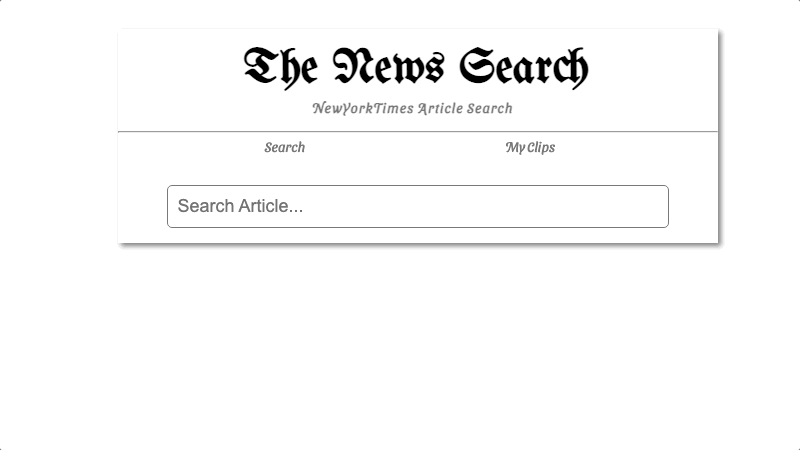

## 뉴욕타임즈 기사 검색 사이트
### 패스트캠퍼스 메가바이트 스쿨 프론트엔드 개발자 과정 React 미니 프로젝트



---

## Version


---

## 개발명세서
### routing
```
  - "/" url에서 기사 검색 페이지 렌더
  - "clip" url에서 내가 clip한 기사 페이지를 렌더
  - 그외 url은 "/"로 redirect
```

### input
```
  - 마지막 타이핑 이후 0.5초 동안 추가 입력이 없고, input value가 있는 경우 검색 api 호출
  - 최대 5개까지 search history 저장되며, 브라우저가 종료되어도 지속될 것
  - search history가 존재하고, input에 focus중이면 search history가 노출 될 것
```

### news list
```
  - "/", "/clip"은 기사 리스트를 렌더
  - 기사 리스트는 다음 내용을 포함하는 기사 카드를 렌더 할 것
    - 타이틀
    - 날짜
    - clip on/off 버튼
    - 클릭 시 해당 기사로 바로가기
  - infinite scroll 
    - 스크롤이 마지막에 닿았을 경우 다음 페이지로 렌더
    - 첫 페이지가 화면의 높이를 모두 채우지 못한 경우 다음 페이지로 렌더
```

### clip
```
  - 기사 카드의 clip 버튼을 클릭해 해당 기사를 즐겨찾기한다.
  - clip된 기사들은 "/clip"에서 확인할 수 있다.
  - clip된 기사들은 브라우저를 재시작하여도 유지된다.
  - 기사를 unclip하면 더이상 "/clip"에서 확인할 수 없다.
```

### 기타
```
  - create-react-app 사용
  - react-router-dom 사용
  - redux 사용
  - 스타일링 및 방식은 자유
```
---

